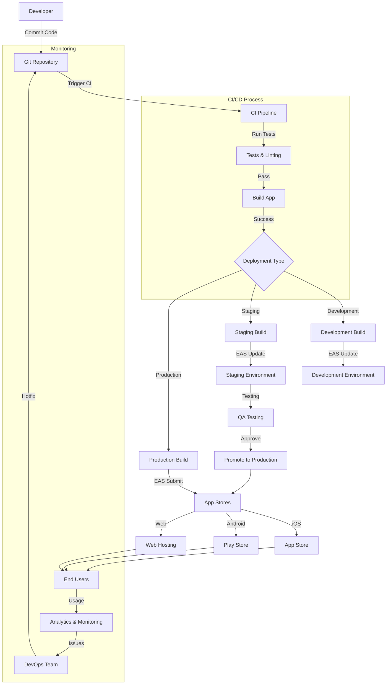

# MindBook Pro - Deployment Guide

This guide outlines the process for deploying the MindBook Pro application to various platforms including iOS, Android, and web environments.

## Table of Contents

1. [Prerequisites](#prerequisites)
2. [Environment Setup](#environment-setup)
3. [Local Development Environment](#local-development-environment)
4. [Deployment Workflows](#deployment-workflows)
   - [Development](#development)
   - [Staging](#staging)
   - [Production](#production)
5. [iOS Deployment](#ios-deployment)
6. [Android Deployment](#android-deployment)
7. [Web Deployment](#web-deployment)
8. [CI/CD Pipeline](#cicd-pipeline)
9. [Environment Variables](#environment-variables)
10. [Monitoring & Analytics](#monitoring--analytics)
11. [Rollback Procedures](#rollback-procedures)
12. [Troubleshooting](#troubleshooting)

## Deployment Flow Diagram



## Prerequisites

Before deploying MindBook Pro, ensure you have the following:

- Node.js (LTS version specified in `.nvmrc`)
- Yarn or npm
- Expo CLI: `npm install -g expo-cli`
- EAS CLI: `npm install -g eas-cli`
- For iOS: Xcode and CocoaPods
- For Android: Android Studio, JDK, and Gradle
- Access to Apple Developer and Google Play Console accounts
- AWS account with necessary permissions
- Git access to the repository

## Environment Setup

1. Clone the repository:

   ```bash
   git clone https://github.com/your-org/mindbook-pro.git
   cd mindbook-pro
   ```

2. Install dependencies:

   ```bash
   yarn install
   # OR with npm
   npm install
   ```

3. Setup environment variables:

   ```bash
   cp .env.example .env
   ```

4. Configure environment variables for different environments:

   - `.env.development`
   - `.env.staging`
   - `.env.production`

5. Run environment check to validate your setup:
   ```bash
   yarn env-check
   # OR with npm
   npm run env-check
   ```

## Local Development Environment

Start the development server:

```bash
# With low log verbosity (recommended)
yarn start
# OR with npm
npm run start

# With full verbosity
yarn start:verbose
# OR with npm
npm run start:verbose

# For specific platforms
yarn ios     # OR npm run ios
yarn android # OR npm run android
yarn web     # OR npm run web
```

## Deployment Workflows

### Development

Development builds are created automatically on feature branches:

```bash
eas build --profile development --platform all
```

### Staging

Staging builds should be created for pre-release testing:

```bash
eas build --profile staging --platform all
```

After successful testing, promote to production channel:

```bash
eas update:promote --from staging --to production
```

### Production

Production builds should only be created from the `main` branch:

```bash
eas build --profile production --platform all
```

## iOS Deployment

1. Configure app.json with your bundle identifier and Apple Developer Team ID:

   ```json
   {
     "expo": {
       "ios": {
         "bundleIdentifier": "com.yourcompany.mindbook",
         "buildNumber": "1.0.0"
       }
     }
   }
   ```

2. Build for iOS:

   ```bash
   eas build --platform ios --profile production
   ```

3. Submit to TestFlight:

   ```bash
   eas submit --platform ios
   ```

4. Review in TestFlight and release to App Store.

## Android Deployment

1. Configure app.json with your package name:

   ```json
   {
     "expo": {
       "android": {
         "package": "com.yourcompany.mindbook",
         "versionCode": 1
       }
     }
   }
   ```

2. Build for Android:

   ```bash
   eas build --platform android --profile production
   ```

3. Submit to Play Store:

   ```bash
   eas submit --platform android
   ```

4. Review in Play Console and release to users.

## Web Deployment

1. Build the web version:

   ```bash
   expo build:web
   ```

2. Deploy to hosting provider:

   ```bash
   # For AWS S3
   aws s3 sync web-build/ s3://your-bucket-name/

   # For Netlify
   netlify deploy --prod --dir=web-build

   # For Vercel
   vercel --prod web-build/
   ```

## CI/CD Pipeline

MindBook Pro uses GitHub Actions for CI/CD. The workflow is defined in `.github/workflows` directory:

- `ci.yml`: Runs linting, type checking, and tests on every PR
- `deploy-dev.yml`: Deploys to development environment on feature branch push
- `deploy-staging.yml`: Deploys to staging environment on `develop` branch push
- `deploy-prod.yml`: Deploys to production environment on `main` branch push

Additionally, CircleCI is configured in `.circleci/config.yml` for parallel CI workflows.

## Environment Variables

Manage environment variables using the following guidelines:

1. Local development: Use `.env` file
2. CI/CD: Use GitHub Secrets and CircleCI Environment Variables
3. EAS: Use EAS Secrets

To set up EAS secrets:

```bash
eas secret:create --scope project --name SUPABASE_URL --value "https://your-project.supabase.co"
```

Refer to `EAS-SECRETS-GUIDE.md` for detailed instructions on managing secrets.

## Monitoring & Analytics

After deployment, monitor the application using:

1. Expo Application Services Dashboard
2. Firebase Analytics
3. Sentry for error tracking
4. CloudWatch for server monitoring

## Rollback Procedures

If issues are detected in a production release:

1. For OTA updates:

   ```bash
   eas update:rollback --channel production
   ```

2. For store deployments:

   - iOS: Revert to previous version in App Store Connect
   - Android: Revert to previous version in Play Console

3. For web: Redeploy the previous version or revert to a previous deployment point in your hosting provider.

## Troubleshooting

### Common Issues

1. **Build Failures**

   - Check the error logs in EAS Build
   - Ensure all native dependencies are compatible
   - Verify your environment variables are correctly set

2. **Deployment Rejections**

   - Review Apple/Google guidelines for app submissions
   - Address privacy policy and data collection requirements
   - Ensure proper app permissions are justified

3. **OTA Update Issues**

   - Check compatibility between native code and JavaScript bundle
   - Ensure assets are properly included in the update

4. **Performance Issues**
   - Use Expo Performance monitoring
   - Analyze bundle size with `npx expo-doctor`
   - Profile the app using React DevTools and Flipper

### Getting Help

If you encounter issues not covered in this guide:

1. Check the [Expo documentation](https://docs.expo.dev/)
2. Review the [React Native documentation](https://reactnative.dev/docs/getting-started)
3. Search the [Expo Forums](https://forums.expo.dev/)
4. Contact the MindBook Pro DevOps team at `devops@mindbook.com`

## Version History

| Version | Date       | Changes                         |
| ------- | ---------- | ------------------------------- |
| 1.0.0   | 2025-01-01 | Initial deployment guide        |
| 1.1.0   | 2025-02-15 | Added CI/CD pipeline details    |
| 2.0.0   | 2025-03-20 | Updated for Expo SDK 52         |
| 2.1.0   | 2025-03-25 | Added web deployment procedures |

> **Note**: This guide includes both yarn and npm commands. Use the package manager that you prefer or that is already set up in your environment.
