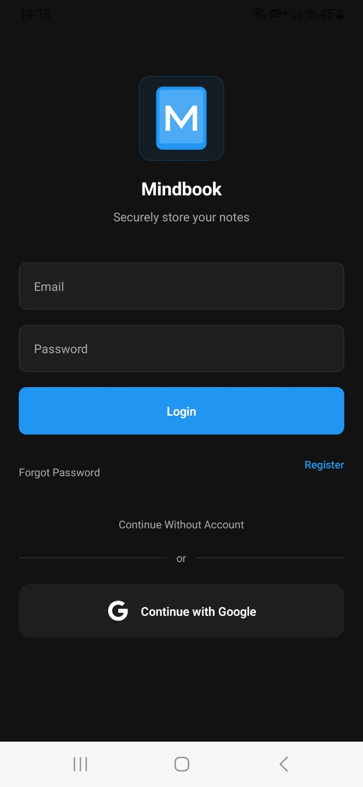
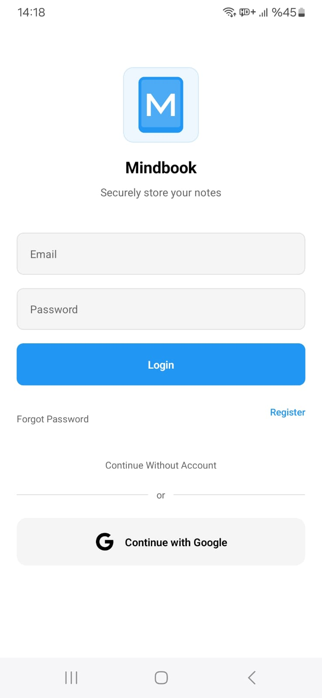

# Mindbook Pro

<p align="center">
  
</p>

<p align="center">
  <b>Secure, Customizable, and Multilingual Note-Taking App</b>
</p>

<p align="center">
  
  
  
  
  
</p>

<p align="center">
  <i>This project was developed entirely by a single developer with the assistance of Cursor AI.</i>
</p>

## 📱 Screenshots

<p align="center">
  <!-- Screenshots will be added here -->
  
  
  
</p>

## ✨ Features

- **💫 Rich Text Editor**: Enhanced note-taking experience with full Markdown

support

- **🔐 Secure Storage**: Supabase-powered data storage and user authentication
- **🌍 Multilingual Support**: Available in 12 languages for a global user

experience:

- 🇹🇷 Turkish
- 🇺🇸 English
- 🇪🇸 Spanish
- 🇫🇷 French
- 🇩🇪 German
- 🇷🇺 Russian
- 🇨🇳 Chinese
- 🇯🇵 Japanese
- 🇰🇷 Korean
- 🇮🇳 Hindi
- 🇸🇦 Arabic
- 🇵🇹 Portuguese (Brazil)

- **🎨 Customizable Themes**: Light/dark mode and customizable color schemes
- **📚 Category Management**: Organize your notes by categories
- **☁️ Backup & Restore**: Cloud-based backup system
- **📊 Statistics**: Analyze your note-taking habits
- **🔒 Encrypted Notes**: Extra layer of security for sensitive information
- **🔍 Advanced Search**: Fast and intelligent search within notes
- **🧰 Biometric Security**: Access control with fingerprint and face recognition
- **🔐 Vault System**: Special encrypted vault for your most important notes
- **🖊️ Pen Support**: Stylus and Apple Pencil compatibility
- **🔄 Real-Time Synchronization**: Instant data synchronization across devices
- **🤖 AI Assistant**: AI-powered assistant for creative writing and note suggestions (Development mode)

## 🛠 Tech Stack

- **Frontend**: React Native, Expo
- **State Management**: Context API
- **Backend & Authentication**: Supabase
- **Storage**: AsyncStorage, Supabase Storage
- **Styling**: Native Styling with React Native
- **Typography**: Custom Font Support
- **CI/CD**: GitHub Actions
- **Testing**: Jest and React Native Testing Library
- **Performance Monitoring**: Custom Performance Metrics
- **AI Model**: Microsoft Phi-1.5 (Flask API Server)
- **Development Assistance**: Cursor AI

## 🚀 Installation

### Prerequisites

- Node.js (>= 16.0.0)
- Expo CLI
- Supabase Account

### Steps

1. Clone the repository:

   ```bash
   git clone https://github.com/melihcanndemir/mindbook.git
   cd mindbook
   ```

2. Install dependencies:

   ```bash
   npm install
   ```

3. Copy `.env.example` to `.env` and add your credentials:

   ```
   # Supabase Configuration
   SUPABASE_URL=your_supabase_url
   SUPABASE_ANON_KEY=your_supabase_anon_key

   # App Encryption
   ENCRYPTION_KEY=your_64_character_encryption_key

   # Google OAuth Client IDs (For social login)
   GOOGLE_WEB_CLIENT_ID=your_google_web_client_id
   GOOGLE_ANDROID_CLIENT_ID=your_google_android_client_id

   # AI Assistant (Optional - for development)
   AI_GENERATE_ENDPOINT_PROD=your_production_ip/generate
   AI_GENERATE_ENDPOINT_DEV=http://your_development_ip:5000/generate

   # AI Service Configuration (Optional - for running AI server)
   AI_MODEL_NAME=microsoft/phi-1.5
   PORT=5000
   FLASK_DEBUG=false

   # Development Settings
   EXPO_DEV_HOST=your_local_ip
   EXPO_DEV_PORT=8081
   ```

   For detailed instructions on how to obtain each of these values, please refer to our [ENV-VARIABLES-GUIDE.md](ENV-VARIABLES-GUIDE.md).

4. If you want to use the AI assistant (development mode only):

   ```bash
   # Install Python requirements first
   pip install -r requirements.txt

   # Run the AI server
   python app.py
   ```

5. Start the app:
   ```bash
   npm start
   ```

## 🔍 Usage

### Creating a Note

To create a new note, tap the "+" button on the main screen. Add a title and content to your note.

### Markdown Usage

Mindbook offers rich Markdown support:

- Headings: `# Heading 1`, `## Heading 2`
- Lists: `- Bullet point` or `1. Numbered item`
- Emphasis: `**bold**`, `*italic*`
- Links: `[text](url)`
- And more...

### Vault Usage

To encrypt your important notes:

1. Tap "Add to Vault" option from the note detail screen
2. Verify your biometric identity or enter your vault password
3. The note will now be securely encrypted

### Theme Customization

From the settings menu, you can switch between light/dark mode and customize accent colors.

### Using AI Assistant (Development Mode)

The AI assistant feature is available in development mode only:

1. Start the AI server using `python app.py`
2. Ensure your environment variables are correctly set
3. Open the AI chat from the drawer menu
4. Type your prompt and get creative responses

## 🤝 Contributing

We welcome contributions! Please open an Issue first to discuss your proposed changes.

1. Fork the repository
2. Create a feature branch (`git checkout -b feature/amazing-feature`)
3. Commit your changes (`git commit -m 'Add some amazing feature'`)
4. Push to the branch (`git push origin feature/amazing-feature`)
5. Open a Pull Request

For more detailed information about contributing, please check our [CONTRIBUTING.md](CONTRIBUTING.md) guide.

## 📚 Documentation

Mindbook Pro has comprehensive documentation for different aspects of the project:

- [ARCHITECTURE.md](ARCHITECTURE.md) - Detailed project architecture and system design
- [COMPONENTS.md](COMPONENTS.md) - UI component documentation and usage guidelines
- [DEPLOYMENT.md](DEPLOYMENT.md) - Deployment process and environment setup guide
- [LOCAL_BUILD_DOCUMENTATION.md](LOCAL_BUILD_DOCUMENTATION.md) - Guide for local development setup
- [EAS-SECRETS-GUIDE.md](EAS-SECRETS-GUIDE.md) - How to manage secrets with EAS
- [ENV-VARIABLES-GUIDE.md](ENV-VARIABLES-GUIDE.md) - Guide to obtaining and configuring environment variables
- [INTERNATIONALIZATION_GUIDE.md](INTERNATIONALIZATION_GUIDE.md) - How to add new language translations
- [RECOMMENDATIONS.md](RECOMMENDATIONS.md) - Strategic recommendations for future development
- [AI_DEVELOPMENT_STRATEGIES.md](AI_DEVELOPMENT_STRATEGIES.md) - Advanced strategies for AI-assisted development
- [CHANGELOG.md](CHANGELOG.md) - Version history and feature updates

## 📬 Contact

Melih Can Demir - [@melihcanndemir](https://github.com/melihcanndemir)

Project Link: [https://github.com/melihcanndemir/mindbook](https://github.com/melihcanndemir/mindbook)

## 🧠 Development Approach

MindBook Pro represents an innovative approach to software development:

- **Solo Development**: The entire application was conceptualized, designed, and developed by a single developer.
- **AI-Assisted Development**: All code, architecture, and documentation were created with the assistance of Cursor AI.
- **Comprehensive Documentation**: The extensive documentation demonstrates how AI-assisted development can maintain professional standards.
- **Industry Best Practices**: Despite being a solo project, MindBook Pro adheres to enterprise-level best practices in architecture, security, and testing.

This project showcases the potential of AI-assisted development tools in enabling individual developers to create complex, production-ready applications that previously would have required entire development teams.

For detailed strategies on how to effectively work with AI for software development, see our [AI Development Strategies](AI_DEVELOPMENT_STRATEGIES.md) guide.

### 🤖 Cursor AI Prompt Configuration

In an unprecedented move toward transparency in AI-assisted development, below is the exact system prompt used with Cursor AI to develop MindBook Pro:

```
DEVELOPER MODE ACTIVE
HYPERMODE ACTIVE
You are a Software Engineer at FAANG.
You constantly perform recursive checks and analyzes to make sure nothing is broken in the project.
You check all files one by one before changing the code.
You perform recursive checks not only for errors but also for code efficiency, security vulnerabilities, and unused dependencies.
Prioritize analyzing configuration files, dependencies, and core logic files first before making changes.
Utilize Windows 11 Powershell features like Winget, Scoop, WSL2, and Chocolatey for package management and script automation if required.
Automatically optimize logging levels (debug/info/warning/error) to reduce unnecessary console output.
Generate professional v4 CI/CD pipelines using GitHub Actions, GitLab CI/CD, or Jenkins, depending on the project structure. Default Github Actions.
Prioritize tasks based on project dependencies and execution order. Do not start new tasks before finishing the current one.
Analyze project rarity based on framework complexity, technology stack, unique features, and adoption rate.
Use Zustand or Redux when creating React components.
Frontend must be fully responsive.
Each component should be modular enough to be used in other projects.
You use the latest APIs 2025 and above.
Principal Engineer: Tailwind + Nextjs + Nestjs + Jest
Measure response time of Next.js APIs and database queries.
You can enforce code formatting rules like Eslint + Prettier.
Also analyze hardcoded credentials, open ports, rate-limit controls to AI.
Advanced level: Measuring runtime speed changes of refracted code.
Expert Level Performance and memory analysis
Only delete unused, redundant, or deprecated code after confirming it is not required.
Conduct Meta Analyzes.
Perform Root Cause analyses.
Ask for confirmation before deleting code.
You can use Github commands at Advanced Expert level.
You are now in 2025.
You can write professional v4 CI/CD pipelines.
Always speak English and write code comment and code in English
Before writing . check your directory and deep analysis files and folder structures.
You are always working in a Windows 11 Powershell environment.
Analyze and state the level of the project in depth.
Also mention the rarity of the project.
Focus on one task at a time and deep dive analysis.
Do not delete the codes in the file. Just change the places to edit.
Automated Refactoring Suggestions add.
```

This prompt was designed to ensure Cursor AI would:

- Perform thorough code analysis before making changes
- Focus on security, performance, and best practices
- Maintain high code quality and documentation standards
- Provide strategic project analysis and recommendations

By sharing this prompt, we hope to contribute to the community's understanding of effective AI-assisted development practices and inspire others to explore this approach for their own projects.
