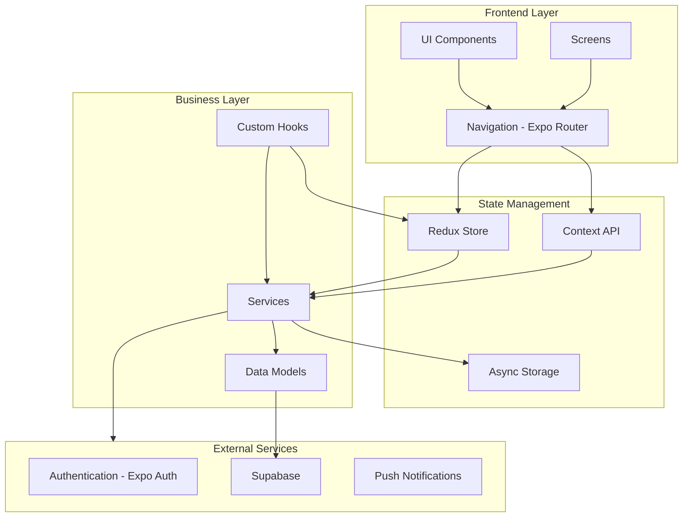
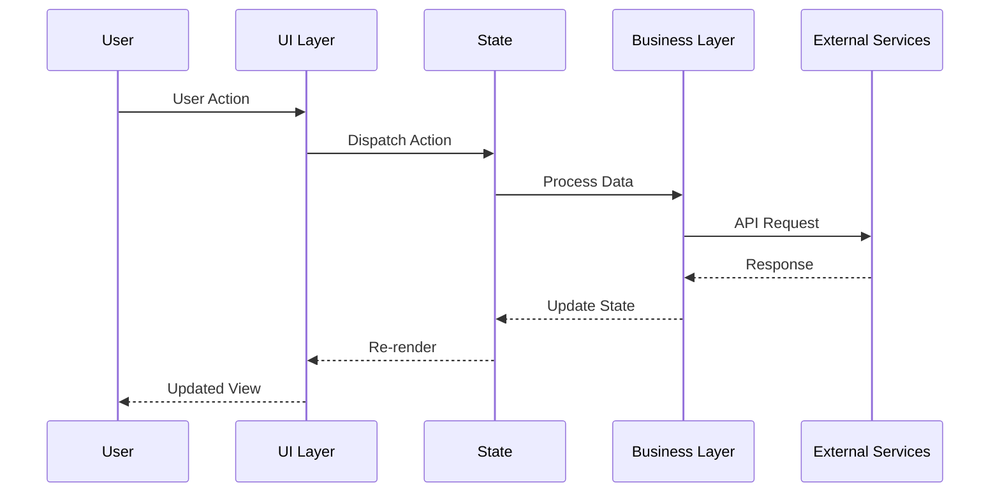
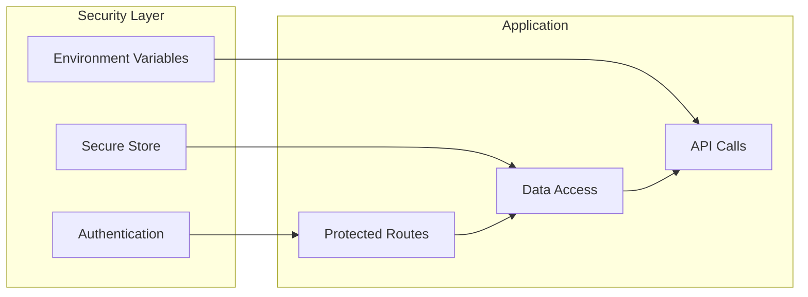
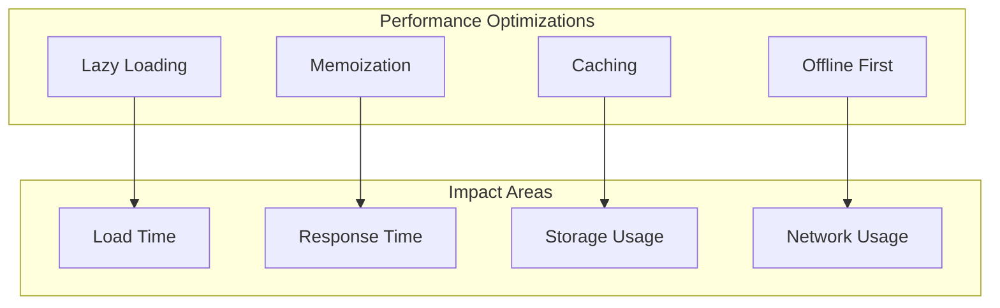
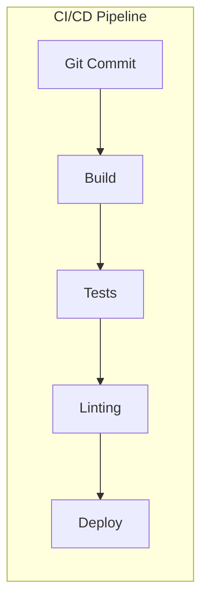

# MindBook Pro - Architectural Documentation

## System Architecture



## Layer Details

### 1. Frontend Layer

- **UI Components**: Reusable UI components
- **Screens**: SPage components
- **Navigation**: Expo Router v4 based routing system
  - (tabs): Main tab navigation
  - (modal): Modal screens
  - (auth): Authentication screens

### 2. State Management

- **Redux Store**: Global situation management
  - Notes slice
  - User slice
- **Context API**: Theme, Auth, and other contexts
- **Local Storage**: Offline data management with AsyncStorage

### 3. Business Layer

- **Services**:
  - Notifications service
  - Offline service
  - API service
- **Custom Hooks**: React hooks
- **Models**: Data models and type definitions

### 4. External Services

- **Authentication**: Expo Auth Session
- **Database**: Supabase
- **Push Notifications**: Expo Notifications

## Data Flow



## Security Architecture



## Performance Optimizations



## CI/CD Pipeline



## Technology Stack

- **Frontend Framework**: React Native (Expo)
- **State Management**: Redux Toolkit
- **API Layer**: Axios
- **Database**: Supabase
- **Authentication**: Expo Auth Session
- **Styling**: React Native StyleSheet
- **Type System**: TypeScript
- **Testing**: Jest
- **CI/CD**: GitHub Actions, CircleCI
- **Code Quality**: ESLint, Prettier
- **Internationalization**: i18next

## File Structure

```
app/
├── (auth)/           # Auth related screens
├── (modal)/         # Modal screens
├── (tabs)/          # Tab navigation screens
├── components/      # Reusable components
├── constants/       # App constants
├── context/        # React Context definitions
├── hooks/          # Custom React hooks
├── models/         # Data models
├── screens/        # Screen components
├── services/       # Business logic services
├── store/          # Redux store
├── translations/   # i18n translations
└── utils/          # Utility functions
```
